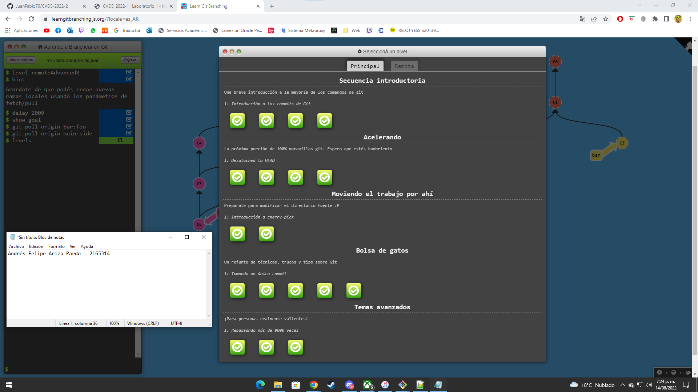
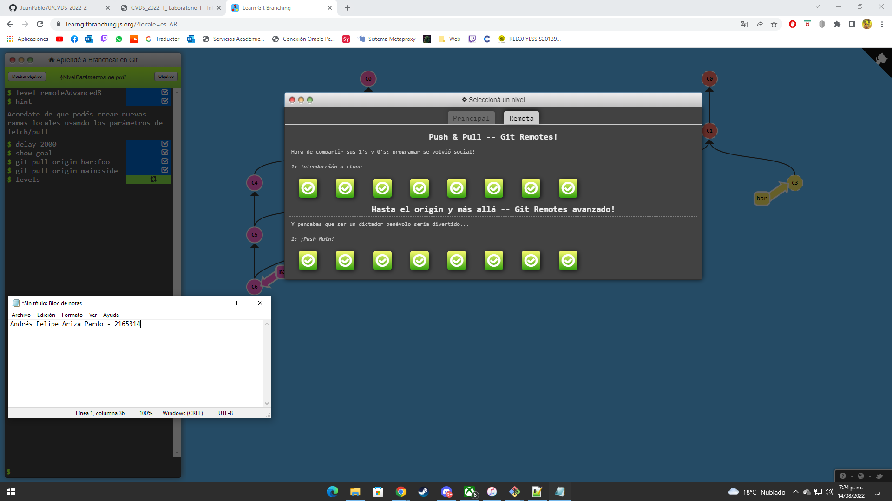

# **Andrés** *Ariza*
## Ingeniería de Sistemas
## 8 semestre

Mis materias de este semestre son:
* CVDS
* BCHN
* FDGP
* SPTI
* PSOC

Los proyectos para este semestre son:
1. Proyecto CVDS
2. Proyecto FDGP
3. Proyecto BCHN

[Repositorio](https://github.com/JuanPablo70/CVDS-2022-2)





```
I love CVDS
```